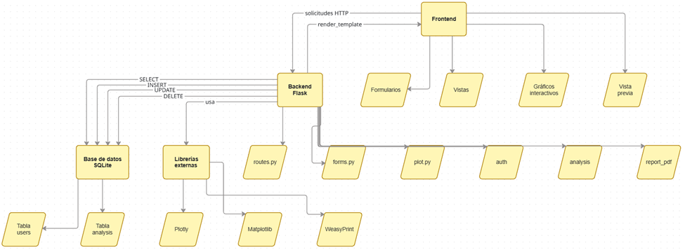

# Arquitectura de Software

## 1. Diagrama de Arquitectura

El diagrama anterior representa la estructura general del sistema SIR desarrollado en Flask. Se organiza en capas para mostrar la interacción entre el frontend, el backend, la base de datos y las librerías externas utilizadas para el procesamiento numérico y la generación de gráficos y reportes.

---

## 2. Estilo arquitectónico

El sistema adopta una **arquitectura MVC simplificada**, adaptada al ecosistema de Flask:

- **Modelo:** gestionado mediante SQLite, donde se almacenan usuarios y análisis.
- **Vista:** implementada con plantillas HTML y Jinja2.
- **Controlador:** definido a través de las rutas y funciones del backend Flask.

Este enfoque permite mantener una separación clara entre la lógica de negocio, la presentación y la persistencia de datos, facilitando el mantenimiento y la escalabilidad del prototipo.

---

## 3. Componentes principales

### **Modelos (SQLite)**
- Tabla `users`
- Tabla `analysis`

### **Controladores (Flask)**
- `routes.py` para la gestión de rutas principales
- Módulos internos: `auth`, `analysis`, `report_pdf`

### **Vistas (Frontend)**
- Plantillas HTML con Jinja2
- Bootstrap 5 para estilos responsivos
- Gráficos interactivos con Plotly

### **Formularios (WTForms)**
- Validación de datos de registro, login y parámetros epidemiológicos

### **Gráficos**
- **Plotly:** gráficos interactivos para la interfaz web
- **Matplotlib:** gráficos estáticos para reportes PDF

### **Exportación PDF**
- **WeasyPrint:** conversión de plantillas HTML a documentos PDF

---

## 4. Flujo de datos

El flujo de datos del sistema sigue el ciclo clásico de una aplicación web basada en Flask:

1. **Solicitud del usuario (HTTP Request)**  
   El usuario interactúa con la interfaz y envía una solicitud al servidor Flask.

2. **Controlador (Flask)**  
   La ruta correspondiente procesa la solicitud, valida datos y ejecuta la lógica necesaria.

3. **Acceso a la base de datos (SQLite)**  
   El backend realiza operaciones `SELECT`, `INSERT`, `UPDATE` o `DELETE` según corresponda.

4. **Procesamiento y generación de resultados**  
   - Ejecución del modelo SIR  
   - Generación de gráficos (Plotly o Matplotlib)  
   - Preparación de reportes PDF (WeasyPrint)

5. **Respuesta al usuario (HTTP Response)**  
   Flask devuelve una plantilla renderizada o un archivo PDF generado dinámicamente.

Este flujo garantiza una experiencia fluida, coherente y centrada en las tareas principales del usuario.

---
