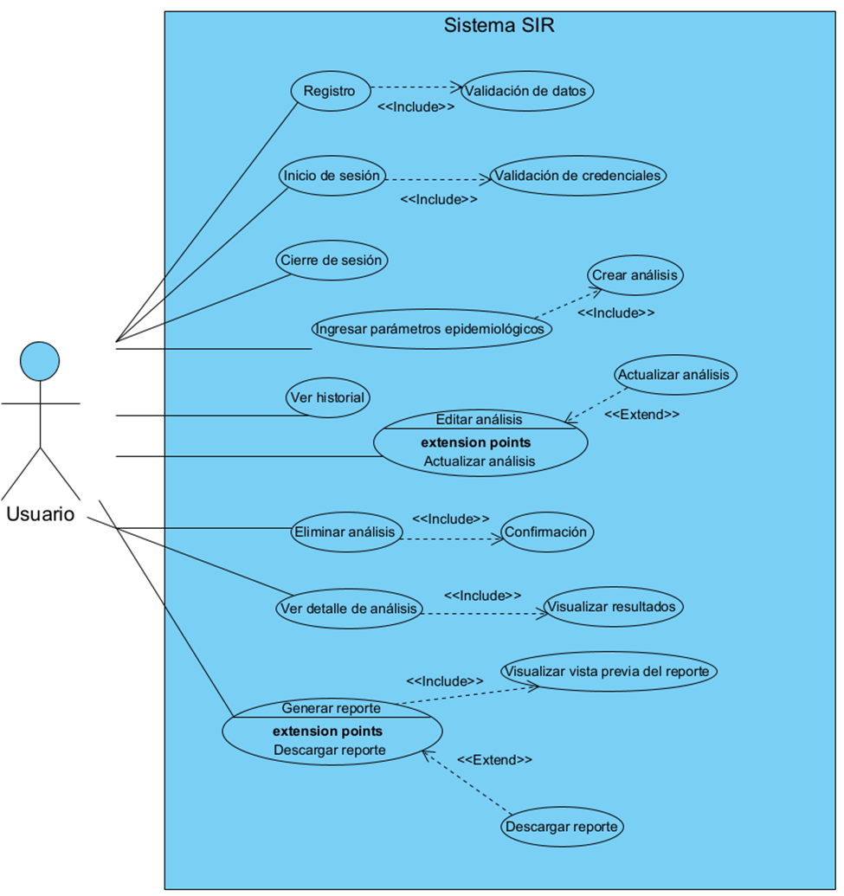

# Diagrama de Casos de Uso

El diagrama de casos de uso modela las interacciones principales entre el Usuario y el sistema SIR. Su propósito es representar, desde una perspectiva funcional, las acciones que el usuario puede realizar y cómo estas se relacionan con los procesos internos del sistema. Este diagrama permite validar la coherencia entre la navegación, la lógica del sistema y los principios de diseño centrado en el usuario.

---

## 1. Actores

### **Usuario**
Representa a la persona que interactúa con el sistema. Puede autenticarse, crear análisis, consultar historial, generar reportes y cerrar sesión.

### **Sistema**
Entidad que ejecuta la lógica interna: validación de datos, procesamiento del modelo SIR, generación de gráficos y creación de reportes PDF.

---

## 2. Casos de uso principales

### **Autenticación**
- **Registrarse:** El usuario crea una cuenta nueva.  
- **Iniciar sesión:** El usuario accede al sistema mediante credenciales válidas.  
- **Cerrar sesión:** Finaliza la sesión activa.

### **Simulación del modelo SIR**
- **Ingresar parámetros epidemiológicos:** El usuario define población, β, γ y días.  
- **Crear análisis:** El sistema almacena los parámetros y ejecuta el modelo SIR.  
- **Visualizar resultados:** Se muestran curvas S(t), I(t), R(t) y métricas epidemiológicas.

### **Gestión de análisis (CRUD)**
- **Ver historial:** Lista de análisis creados por el usuario.  
- **Ver detalle:** Muestra los parámetros y resultados de un análisis específico.  
- **Editar análisis:** Permite modificar parámetros y recalcular resultados.  
- **Eliminar análisis:** Elimina un análisis previo del historial.

### **Generación de reportes**
- **Generar reporte:** El sistema prepara una vista previa del reporte.  
- **Vista previa del reporte:** Muestra el contenido antes de exportar.  
- **Descargar PDF:** El usuario obtiene un archivo PDF generado dinámicamente.

---

## 3. Diagrama

---

## 4. Consideraciones de diseño

El diagrama refleja una estructura centrada en tareas, donde el flujo principal del usuario se organiza en torno a la creación y consulta de análisis. Se emplean relaciones *include* y *extend* para representar procesos obligatorios (validación, vista previa) y opcionales (descargar reporte).  
Este modelo garantiza claridad, coherencia y alineación con la arquitectura implementada en Flask.