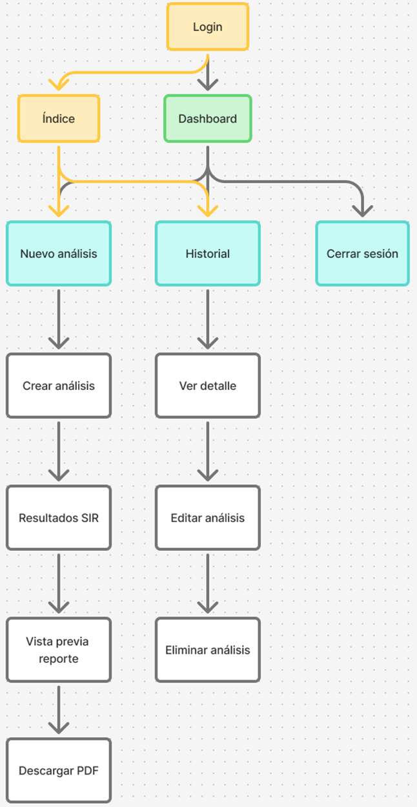

# Mapa de Navegación

El mapa de navegación describe cómo el usuario se desplaza entre las distintas pantallas del sistema SIR. Su propósito es representar de manera clara la estructura jerárquica de la interfaz y los flujos principales que permiten ejecutar simulaciones, consultar historial, generar reportes y gestionar la sesión. Este mapa garantiza que la navegación sea coherente, eficiente y centrada en las tareas clave del usuario.

---

## 1. Descripción general

El flujo de navegación inicia en la pantalla **Inicio de sesión**, accesible sin autenticación. Desde allí, el usuario puede **Iniciar sesión** o dirigirse al **Registro**.  
Una vez autenticado, el usuario accede al **Dashboard**, que funciona como punto central de navegación. Desde esta pantalla se puede:

- Crear un nuevo análisis del modelo SIR  
- Consultar el historial de análisis previos  
- Cerrar sesión  

Cada una de estas rutas conduce a pantallas específicas que permiten ejecutar simulaciones, visualizar resultados, generar reportes PDF o gestionar análisis existentes.

---

## 2. Flujo principal

El flujo principal corresponde al proceso de creación y consulta de un análisis SIR:

Login → Dashboard/Índice → Nuevo análisis → Crear análisis → Resultados SIR → Vista previa reporte → Descargar PDF

Este flujo representa la tarea más importante del sistema: ejecutar una simulación epidemiológica y obtener un reporte descargable.

---

## 3. Flujo secundario

El flujo secundario corresponde a la gestión del historial de análisis:

Dashboard → Historial → Ver detalle → Editar análisis / Eliminar análisis

Este flujo permite al usuario revisar simulaciones anteriores, modificarlas o eliminarlas según sea necesario.

---

## 4. Diagrama

