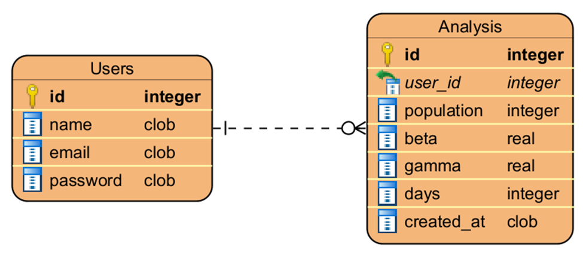

# Modelo Relacional de la Base de Datos

El modelo relacional del sistema SIR se diseñó para ser simple, coherente y funcional, alineado con los requerimientos del prototipo de alta fidelidad. La base de datos utiliza SQLite, una solución ligera y adecuada para aplicaciones académicas, permitiendo almacenar usuarios y análisis epidemiológicos sin necesidad de un servidor adicional.

El diseño final consta de dos tablas principales: `users` y `analysis`, organizadas bajo una relación uno‑a‑muchos que refleja el flujo natural del sistema: un usuario puede generar múltiples simulaciones del modelo SIR.

---

## 1. Diagrama ER

El diagrama entidad–relación muestra la estructura lógica de la base de datos, incluyendo entidades, atributos y relaciones. Este modelo fue simplificado tras descartar la tabla `reports`, ya que los reportes PDF se generan dinámicamente y no requieren persistencia.

---

## 2. Tablas

### Tabla: `users`

| Campo          | Tipo    | Descripción                                      |
|----------------|---------|--------------------------------------------------|
| id (PK)        | INTEGER | Identificador único del usuario                  |
| name           | TEXT    | Nombre del usuario                               |
| email          | TEXT    | Correo electrónico (único)                       |
| password_hash  | TEXT    | Contraseña almacenada de forma segura (hash)     |

**Descripción:**  
Esta tabla almacena la información necesaria para la autenticación y personalización del sistema. El correo electrónico funciona como identificador único, y las contraseñas se almacenan mediante hashing para garantizar seguridad.

---

### Tabla: `analysis`

| Campo          | Tipo    | Descripción                                      |
|----------------|---------|--------------------------------------------------|
| id (PK)        | INTEGER | Identificador único del análisis                 |
| user_id (FK)   | INTEGER | Usuario que creó el análisis                     |
| population     | INTEGER | Población inicial                                |
| beta           | REAL    | Tasa de contagio                                 |
| gamma          | REAL    | Tasa de recuperación                             |
| days           | INTEGER | Duración de la simulación                        |
| created_at     | TEXT    | Fecha de creación del análisis                   |

**Descripción:**  
Esta tabla almacena los parámetros epidemiológicos ingresados por el usuario para ejecutar una simulación del modelo SIR. Cada registro representa un análisis independiente y está vinculado a un usuario mediante una clave foránea.

---

## 3. Relaciones

- **Users (1) → Analysis (N)**  
  Un usuario puede crear múltiples análisis, pero cada análisis pertenece únicamente a un usuario.

Esta relación permite mantener un historial de simulaciones por usuario, facilitando la consulta, edición y eliminación de análisis previos.

---

## 4. Consideraciones de diseño

Durante las primeras etapas se contempló una tabla adicional para almacenar metadatos de reportes PDF. Sin embargo, al avanzar en la implementación se determinó que los reportes se generan dinámicamente mediante WeasyPrint y se entregan directamente al navegador, por lo que no requieren persistencia.

Esto permitió simplificar el modelo relacional, reduciendo complejidad y manteniendo coherencia con la arquitectura final del sistema.